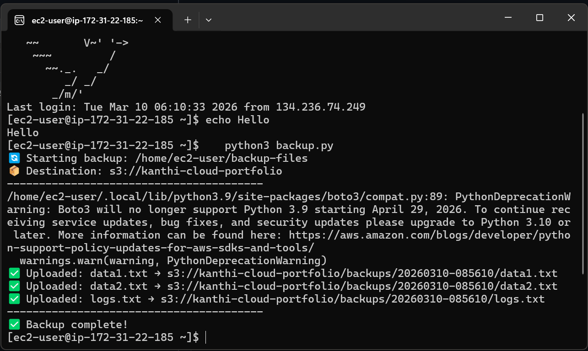
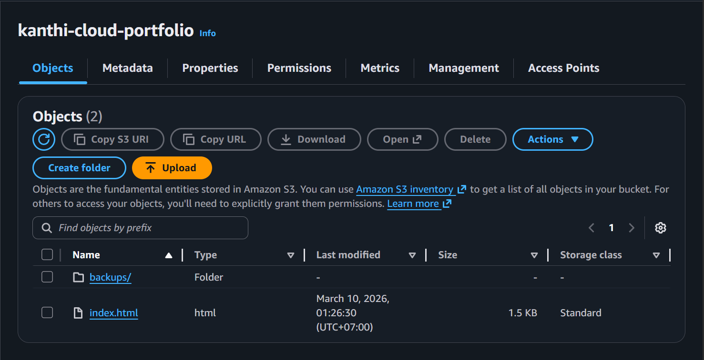

# ☁️ Project #5 — Auto Backup Script to S3

**Author:** Kanthi Phoosorn  
**Date:** March 10, 2026  
**Part of:** [Cloud-Security-Engineer Portfolio](https://github.com/KanthiPhoosorn/Cloud-Security-Engineer)

## 📋 What I Did
- Written Python script to auto backup files to AWS S3
- Used Boto3 library to connect to AWS
- Script creates timestamped backup folders
- Tested with 3 files — all uploaded successfully

## 🛠️ Technologies Used
- Python 3
- Boto3 (AWS SDK)
- AWS S3
- AWS CLI
- Amazon Linux 2023 (EC2)

## 🚀 How to Run
```bash
# Install boto3
pip3 install boto3

# Configure AWS
aws configure

# Run backup
python3 backup.py
```

## ✅ Output
```
🔄 Starting backup: /home/ec2-user/backup-files
📦 Destination: s3://kanthi-cloud-portfolio
----------------------------------------
✅ Uploaded: data1.txt → s3://kanthi-cloud-portfolio/backups/...
✅ Uploaded: data2.txt → s3://kanthi-cloud-portfolio/backups/...
✅ Uploaded: logs.txt  → s3://kanthi-cloud-portfolio/backups/...
----------------------------------------
✅ Backup complete!
```

## 📸 Screenshots



## 💡 What I Learned
- Python Boto3 AWS SDK
- Automated cloud backups
- AWS CLI configuration
- Timestamped file organization on S3

## 🔗 Related Projects
- [Project #4 — EC2 Instance](https://github.com/KanthiPhoosorn/Project-4-AWS-EC2-SSH-Setup)
- [Project #6 — Password Strength Checker](https://github.com/KanthiPhoosorn/Project-6-Password-Strength-Checker)
